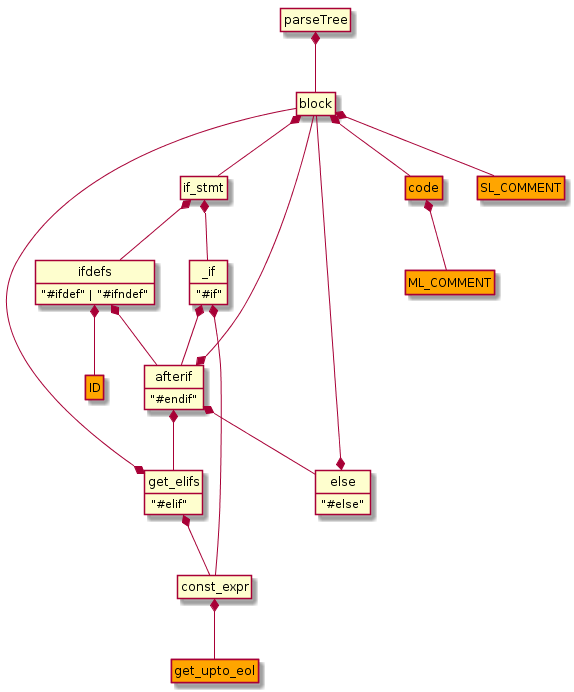
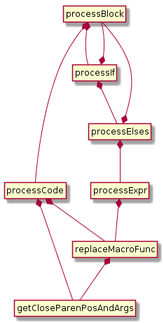
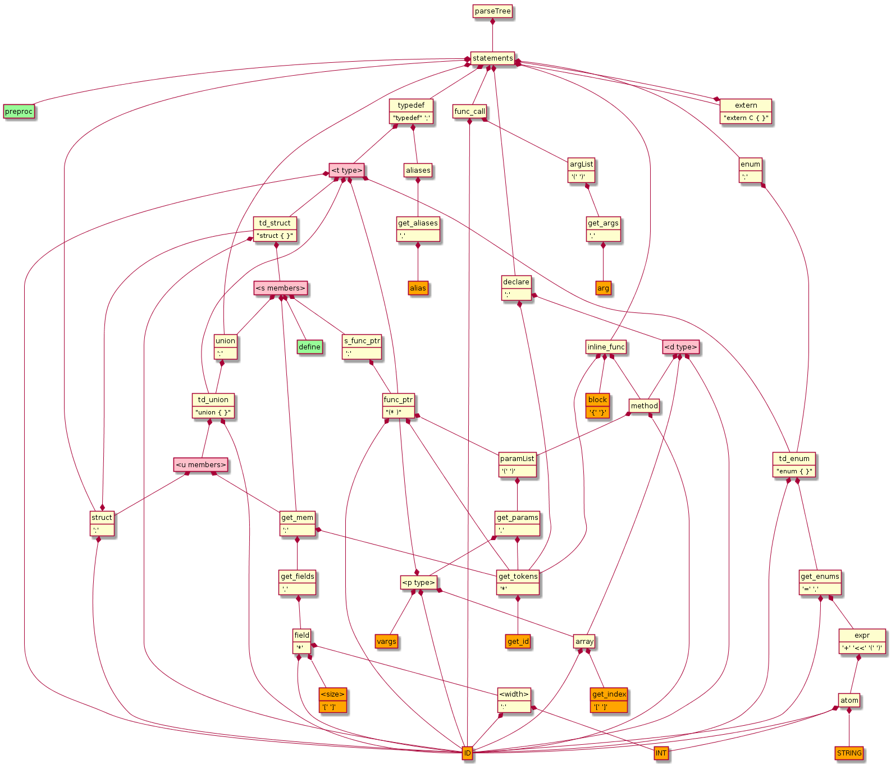
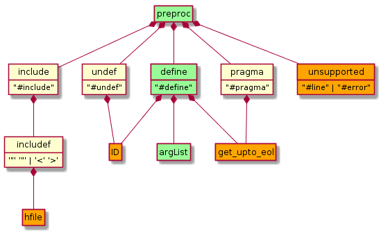

# C header (.h) parser
To simplify/optimize the parser, the C header file must not contain comments or conditional preprocessor macros. 
C header files must first be passed to a separate preprocessor parser, ***c-header-preproc.pegjs***, which evaluates/replaces the preprocessor macros, removes comments and replaces line continuations with concatenated lines. This is a two-stage process. The file is first parsed into either a preprocessor macro conditional expression or its code block to be executed if the condition is met. Comments and line continuations are also removed in this stage. The JSON-formatted parse tree of this stage can be viewed for analysis by including the `{json: true}` option in the parse command. The 2nd stage traverses the parse tree and evaluates/replaces the preprocessor macros. This must be done in sequential order and thus cannot be done during parsing since the actions associated with parse rules are evaluated leaf to root.
## Development
### Abstract Syntax Trees
#### c-header-preproc.pegjs
The parsing stage is simple:   
  
Most work is done in the processing stage. Relationship between the processing functions:  
  
#### c-header-parser.pegjs
(preproc and define continued in next AST)  
  
preproc rule portion of header parser (argList defined in prev AST)  
  

### Work items remaining
- see TODOs in each parser grammar file
- preprocessor
  - Function macro definitions accept two special operators (# and ##) in the replacement sequence:
The operator #, followed by a parameter name, is replaced by a string literal that contains the argument passed, as if enclosed between double quotes. The operator ## concatenates two arguments leaving no blank spaces between them. These are not yet supported.
  - pass in predefined macros in options

## Test notes

### missing matching conditional for '}' 

Added:

```
#ifdef  __cplusplus
    }
#endif
```

to the following files:

- intf/am/amckp/amckp_api_publish.h  
- intf/am/amup/amup_api_encode.h  
- intf/am/amup/amup_api_publish.h  
- intf/am/amup/amup_api_sx_inter.h  
- intf/am/pmckp/pmckp_api.h  
- intf/am/tunnelmap/tunnelmap_api_publish.h  
- intf/common/srv/srv_common.h  

Otherwise, these would fail to parse if the following line was uncommented from ***c-header-preproc.pegjs***:
```
//   var defined = {"__cplusplus":""};

```

### function call?
***./intf/common/srv/packet_ext_api.h*** contains:

    CHECK_STRUCT_SIZE_EQUAL(PACKET_CTRL_INFO_EXT_S, PACKET_CTRL_INFO_EXT_SIZE)

Unless **CHECK_STRUCT_SIZE_EQUAL()** does an assert, not sure if this is valid. Currently this type is parsed as "macro assert".

### typedef aliases types?

Lots of examples of the following:

```
typedef struct tagAPNIPV6RTPARAINDEX
{
    CFG_APNROUTE_S stApnRoute;
    UCHAR ucUsed;
    
    UCHAR ucReserve[3];
    
}VOS_PACKED APNIPV6RTPARAINDEX_S;
```
Aliases must be comma separated, not sure what **VOS_PACKED** is. Seems like a type. Currently this is parsed as a two-word alias.

## Testing
This parser has its own modified versions of test.sh and backup.sh (test-h.sh, backup-h.sh). Output of the preproc phase is stored in "./hpp" and used as input to the parse phase.

The preproc phase is skipped by default. Incude any char/string as arg to test-h.sh to inlude preproc phase.

example test alias:
```
function tst() {
  cd /home/cclare/git/jade/parsers/c-header-parser
  /home/cclare/git/jade/parsers/parser-tools/peggen.sh c-header-preproc
  /home/cclare/git/jade/parsers/parser-tools/peggen.sh c-header-parser
  cd /home/cclare/git/jade/parsers/c-header-parser/test
  ./test-h.sh 1 > /tmp/out
  grep "Error:" hpp/*.hpp *.json > /tmp/out2
}
```


